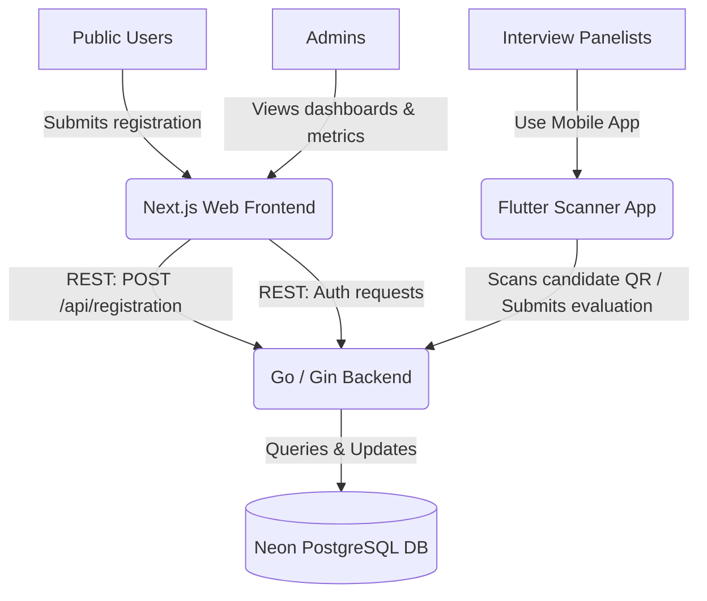

# K-1000 Ecosystem Architecture Documentation

This document provides a comprehensive overview of the K-1000 ecosystem, detailing the design, integration, and data flow between the Next.js Web Frontend, Go Backend API, Flutter Scanner Mobile App, and PostgreSQL Database.

---

## 1. System Architecture Overview

The K-1000 ecosystem is composed of three decoupled components coordinating via a shared PostgreSQL database and standard REST endpoints:

---

## 2. Next.js Web Frontend
* **Path:** `/home/vansh/Projects/K-1000-Website`
* **Technologies:** Next.js 16 (App Router), React 19, Tailwind CSS v4, Framer Motion, GSAP, Lenis.

### Key Capabilities
* **Interactive Portal:** Serves as the landing and informational website utilizing a cyberpunk HUD theme with dynamic Canvas 2D/Three.js backgrounds.
* **Boot Sequence:** [page.tsx](file:///home/vansh/Projects/K-1000-Website/src/app/page.tsx) handles a simulated HUD initialization. The status is cached in `sessionStorage` to run only once per session.
* **Student Registration Portal ([register/page.tsx](file:///home/vansh/Projects/K-1000-Website/src/app/register/page.tsx)):** Houses the multi-step application form. Upon successful submission, it generates a QR code containing the registration ID (scanned by the mobile app during interviews) and calls `POST /api/registration` on the backend.
* **Admin Dashboard ([admin/page.tsx](file:///home/vansh/Projects/K-1000-Website/src/app/admin/page.tsx)):** A secured dashboard allowing organizers to view and search registration submissions and interview scores using password-authorized HTTP requests.

---

## 3. Go Backend API
* **Path:** `/home/vansh/Projects/k1000-backend`
* **Technologies:** Go (1.21+), Gin (Web Framework/HTTP Mux), `pgx` (PostgreSQL client pool), Custom Middleware (CORS, Rate Limiting, Logging).

### REST API Route Map
* **Health Check:** `GET /api/health`
* **Registration Endpoints:**
  * `POST /api/registration` - Creates a new applicant profile.
  * `GET /api/registration/:id` - Fetches a single registration record by ID (queried by the Flutter application).
  * `PUT /api/registration/:id/status` - Updates registration status (`pending`, `selected`, `interviewed`, etc.).
  * `GET /api/registrations` - Lists all registrations.
* **Interview Endpoints:**
  * `POST /api/interviews` - Submits a panelist's evaluation rubric scores for an applicant.
  * `GET /api/interviews/exists?registration_id=X&panelist_roll=Y` - Confirms if a panelist has already evaluated an applicant.
  * `GET /api/interviews/list` - Fetches all evaluation results.
  * `GET /api/interviews/by-panelist?panelist_roll=Y` - Lists history of evaluations performed by a panelist.
  * `GET /api/interviews/with-registration` - Joins registrations and interview tables for administrative dashboards.
* **Admin Endpoints:**
  * `GET /api/admin/registrations` - Authorized endpoint for listing all registrations.

---

## 4. Flutter Scanner Mobile App
* **Path:** `/home/vansh/Projects/registration_scanner_app`
* **Technologies:** Flutter, Dart, `http` (API client), Mobile QR Code Scanner.

### Workflows and Screens
1. **Panelist Sign In (`panelist_signin_screen.dart`):** Panelists authenticate using their Name, Roll Number, Department, and Domain (e.g., OTI, OSG).
2. **Dashboard (`panelist_home_screen.dart`):** Displays statistics of candidates evaluated by the signed-in panelist.
3. **QR Code Scanner (`scanner_screen.dart`):** Panelists scan the candidate's QR code (containing their registration ID).
4. **Candidate Profile (`profile_screen.dart`):** Fetches (`GET /api/registration/:id`) and displays application details (motivation, domain, skills, branch).
5. **Criteria Evaluation (`evaluation_screen.dart`):** Renders sliding rubrics mapping evaluation criteria based on the candidate's domain choice. Submits scores and comments back to the backend (`POST /api/interviews`).

---

## 5. Neon PostgreSQL Database Layer
* **Data Store:** Neon Serverless PostgreSQL.
* **Connection Client:** Configured via `DATABASE_URL` with SSL connection pools.

### Database Tables

#### registrations Table
Tracks applicant data and selection state.
* **Fields:** `id` (BIGSERIAL PK), `full_name`, `email`, `phone`, `kiit_email`, `gender`, `date_of_birth`, `roll_number`, `academic_year`, `course`, `branch`, `domain_choice`, `motivation`, `experience`, `skills` (JSONB), `referral_source`, `status`, `created_at`, `updated_at`.
* **Triggers:** Auto-updates `updated_at` timestamps using custom PL/pgSQL functions.

#### interviews Table
Stores panelist evaluations.
* **Fields:** `id` (BIGSERIAL PK), `registration_id` (FK referencing `registrations`), `panelist_name`, `panelist_roll`, `panelist_branch`, `panelist_domain`, `marks` (float numeric), `remarks`, `status`, `criteria` (JSONB array containing evaluation rubrics matching specific domains), `created_at`, `updated_at`.
